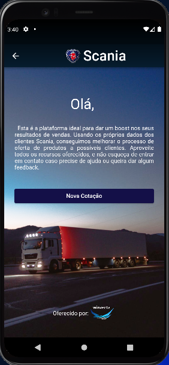
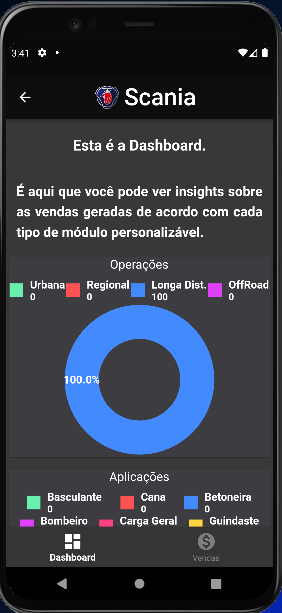
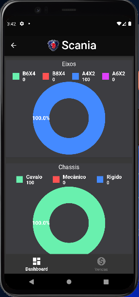
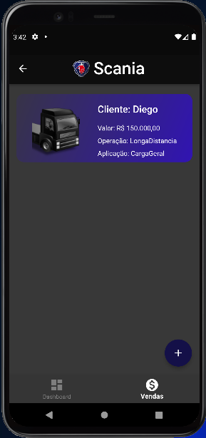
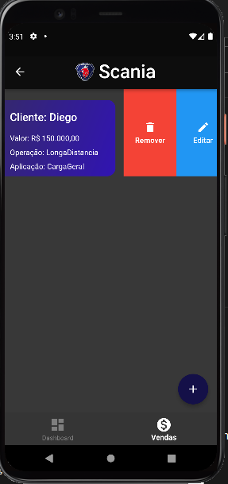
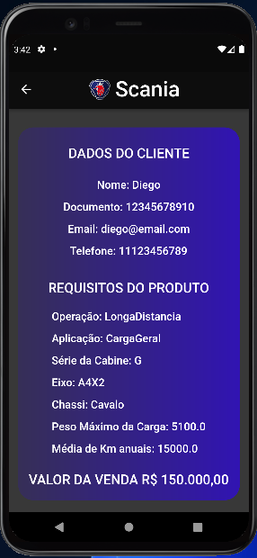
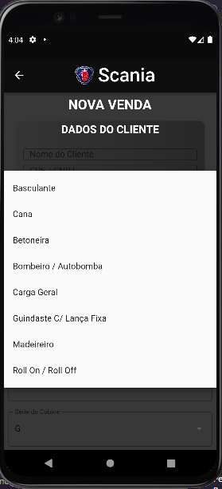

# 🦅 Winvents Checkpoint

## **Desenvolvimento Cross Platform | Android FIAP**

* *Turma:* 3SIT 
* *Graduação:* Sistemas de Informação
* *Ano:* 2022

 
 

## **O Projeto**
### O projeto é baseado no challenge Scania, sendo constituído pelas telas desenvolvidas pelo time, baseadas na proposta de solução oferecida à empresa.
 
 

## A solução 
### Nossa aplicação tem como objetivo auxiliar o processo de vendas, sendo uma solução focada em Sales Intelligence. O projeto funciona da seguinte forma: Ao acessar a aplicação, o usuário encontra a página inicial, onde está descrita a funcionalidade da solução proposta pela equipe da Winvents.

 

### A página inicial leva o vendedor à dashboard,  seção na qual é possível vizualizar dados sobre os módulos personalizáveis de caminhões, o que ajuda nas estatísticas de uso e vendas da empresa.

 

### A segunda seção, que pode ser acessada pelo menu de navegação na parte inferior do aplicavtivo, é a seção de Listagem de Vendas. Ali encontram-se todas as vendas cadastradas, com opções para o usuário, remover, editar ou acessar detalhes de uma venda ao clicar no card.

 
 
 

### Por fim, existe na tela de listagem de vendas, um botão inferior que direciona o usuário para a tela de Cadastro de Novas Vendas, onde ele pode inserir informações sobre o cliente e o caminhão, para gerar um novo registro.

| Autor               | RM                                                |
| ----------------- | ---------------------------------------------------------------- |
| Isabela Caovila Baldim        | 84141 |
| João Vitor Mendes Maria       | 85041 |
| Jonathan Rodrigues Gonçalves  | 85312 |
| Lucas Remedi Markarian Pavão  | 84451 |
| Matheus Nathan Modanez        | 86065 |

 
 
 
 

## 🛠 Skills
Programação em Flutter, pensando no desenvolvimento e melhores práticas para desenvolvimento web e mobile, Padrões de projeto e Código Limpo.

## 👩‍💻 Escopo

 * Um projeto em flutter criado do zero
 * 5 telas de funcionamento da aplicação:
    - Intro
    - Dashboard
    - Lista de Vendas
    - Detalhes de Venda
    - Cadastro de Venda
 
## Feedback

*Se você tiver algum feedback, por favor nos deixe saber por meio do email winventsorg@gmail.com*
